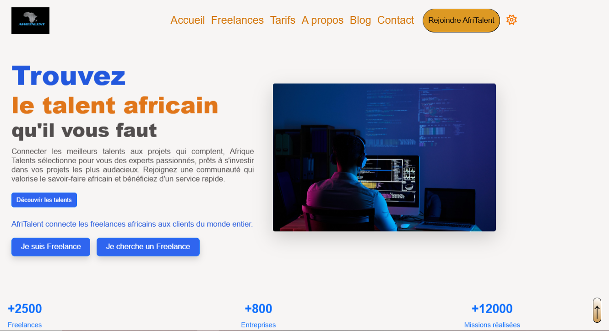
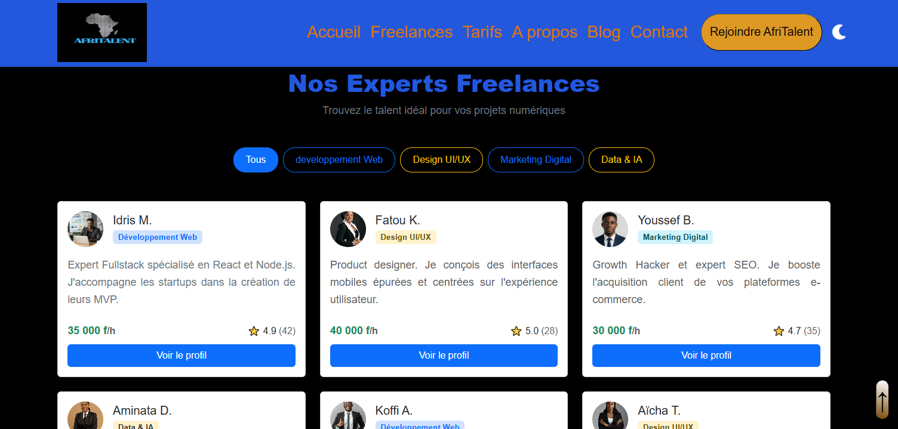
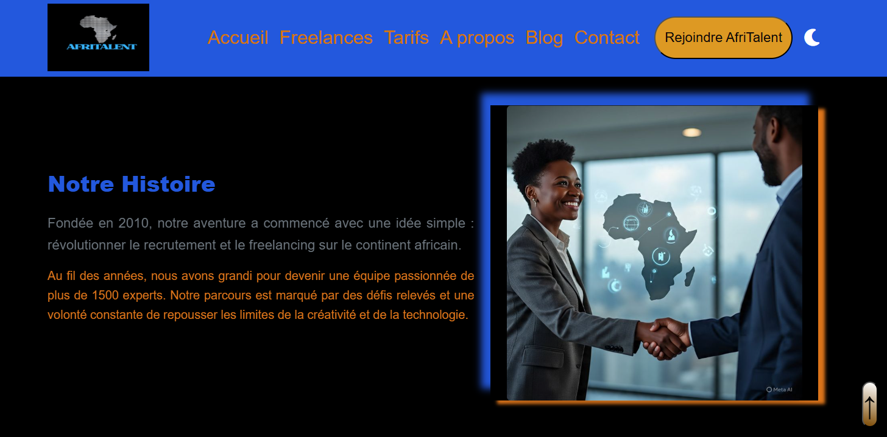
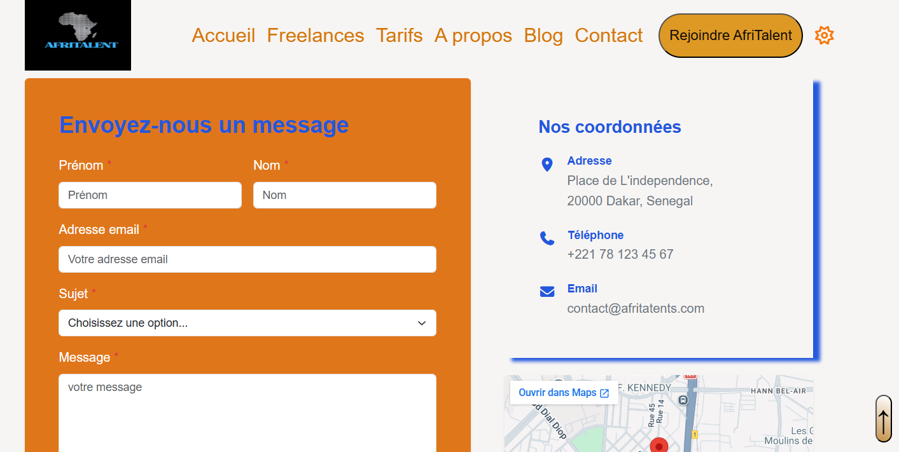

# AfriTalent

Projet fil rouge — Plateforme de mise en relation entre freelances africains et
clients.

Auteur : MOUHAMED MOUSTAPHA FALL
Promotion : L1 IAGE — ISI 

# Description
AfriTalent est une plateforme de marketplace numérique innovante et hautement optimisée, conçue pour combler le fossé entre les entreprises internationales en quête d'excellence et le bassin grandissant de freelances hautement qualifiés dans le secteur de la tech en Afrique. Pensé comme une vitrine technologique complète, le site intègre un catalogue dynamique de profils, des grilles tarifaires transparentes et une section d'assistance interactive afin d'offrir une expérience utilisateur fluide et engageante. Sur le plan visuel, le projet adopte les standards d'ergonomie et de design les plus exigeants de l'industrie (SaaS 2026, Bento Grid, Glassmorphism), mettant ainsi en avant la robustesse des technologies front-end modernes tout en valorisant le savoir-faire numérique et le potentiel d'innovation du continent africain.

# Technologie utilises
-HTML5
-CSS3 / CSS Grid Avancé
-Bootstrap 5
-Vanilla JavaScript
-
# Fonctionnalite Principale du site
-Bento Grid Layout
-Navbar Dynamique
-Toggle Dark Mode Persistant
-FAQ Interactive
-Responsive Design

# Arborescence
'''
FALL-MOUHAMED-AfriTalent/
├── index.html
├── freelances.html
├── tarifs.html 
├── about.html
├── contact.html 
├── css/
│   └── style.css
├── js/
│   └── main.js
├── images/
│   └── (images, logos,)
├── docs/
│   └──
├── README.md
└── .gitignore 

'''

# Capture d'ecran du site 

# Instruction pour le localement du site
1-git hub
2-vs code
3-navigateur web

# Ressource
-MDN Web Docs
-CSS Grid Layout
-Font Awesome Docs
-GitHub Pages Documentation
-tuto
